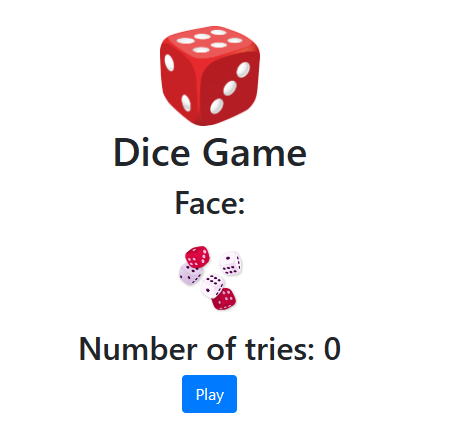
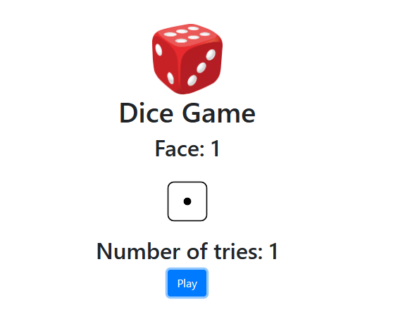
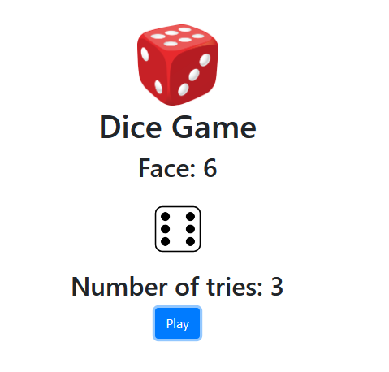
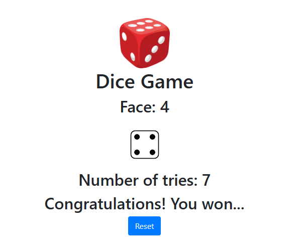
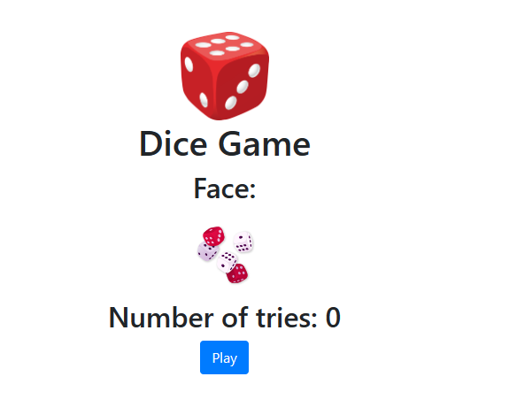

# Dice Game React Component

A simple React component representing a dice game with Bootstrap styling.

## Description

The Dice Game component is a React-based web application that simulates a dice game. Users can click the "Play" button to roll the dice and attempt to match a predefined winning face. The number of attempts is tracked, and if the user successfully matches the winning face, a "Congratulations" message is displayed, and the user can choose to reset the game.

## Features

- Randomly generates dice faces on each play.
- Tracks the number of attempts.
- Displays a winning message upon successful matching.
- Provides a "Reset" button to start a new game.

## Getting Started

1. Clone the repository:

   ```bash
   https://github.com/Josh-techie/Dice_Game
    ```

## Use the  App

### This is the main page:
 -- The main page of the dice game:

 
   

### After rolling you get the following:
   

## Keep in mind the winnig face is 4:

### After, rolling I get the corresponding face: 
   

### Here I got the winning face:
   

### Then use the rest button to play again:
   

## Author:
-- [Josh-techie](https://github.com/Josh-techie)
